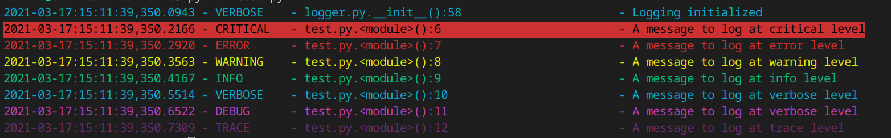

# gbe0 Log

My standard logging module.

## Installation

To install from PyPI:

```bash
python3 -m pip install gbe0-log
```

## Usage

To use in scripts [check example.py](example.py).

Example:

```python
## Import module
from gbe0_log import Logger
import logging as log

## Initialize logger
## This only needs to be done once
Logger(verbosity = 5)

## Log some messages
log.critical('A message to log at critical level') # Always logged (verbosity level 0)
log.error('A message to log at error level') # Always logged (verbosity level 0)
log.warning('A message to log at warning level') # Verbosity level 1
log.info('A message to log at info level') # Verbosity level 2
log.verbose('A message to log at verbose level') # Verbosity level 3
log.debug('A message to log at verbose level') # Verbosity level 4
log.trace('A message to log at trace level') # Verbosity level 5
```

## Example Output

Output is to stderr and looks like this:


